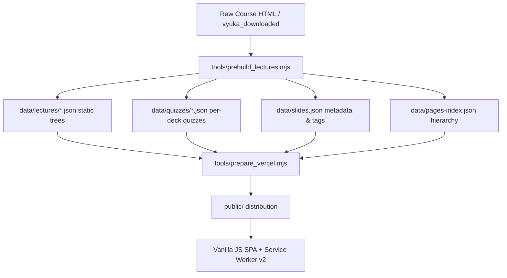

# AGENTS.md — Developer & AI Agent Architecture Guide

## 1. System Overview & Architecture

`newpyt` is a lightweight, high-performance pedagogical web application for teaching Python to university students with prior experience in C, C++, and Java (VŠCHT Praha).



### Key Components & Files
- **Frontend SPA**: `app/js/app.js`, `app/js/router.js`, `app/js/content.js`, `app/js/tree.js`, `app/js/ui.js`
- **Styling & Themes**: `app/css/shell.css`, `app/css/lecture.css`, `app/css/syntax.css`, `app/css/tokens.css` (WCAG 2.1 AA compliant)
- **Data & Build Pipeline**:
  - `tools/prebuild_lectures.mjs`: Parses downloaded HTML decks, associates metadata from `data/slides.json`, extracts quizzes, and prebuilds static JSON slide trees.
  - `tools/prepare_vercel.mjs`: Syncs `app/`, `data/`, and service workers into `public/`.
  - `tools/check_contrast.mjs`: Automated 6-variant WCAG contrast checker (Dark Web, Light Web, Dark Code, Light Code, Print View).

---

## 2. 5-Tier Pedagogical Triage System

When evaluating and tagging slides for 90-minute lectures:

### 1. `Core` (Target: ~60–65%)
- **Definition**: Fundamental concepts, primary APIs, essential language syntax, and core data structure operations.
- **Audience Context**: Essential for students coming from C/C++/Java to write idiomatic, correct Python.
- **Positive Examples**:
  - `dict.get(key, default)`, `list.append()`, `list.pop()`, `open(..., mode="w")` context managers.
  - `try...except...finally`, custom exception definitions, standard exception hierarchy.
  - Class definitions, `__init__`, `self`, basic inheritance, properties.
- **Negative Boundary**: Do NOT tag as Core if the slide contains only low-level disassembly, installation flags, or duplicate introductory overviews.

### 2. `Skip` (Target: ~25–35%)
- **Definition**: Material to omit from live 90-minute lectures (relegated to optional self-study).
- **Mandatory Skip Candidates**:
  - **Raw Dumps & Disassembly**: Opcode traces, AST dumps, binary hex outputs, `pickletools` VM opcodes.
  - **Tool Installation & Flag Minutiae**: Long tables of command-line flags (`-a`, `-l`, `-p`, `--verbose`), compiler toolchain setup (`llvmlite` wheel builds).
  - **Obsolete / Python 2 Legacy**: `__builtin__`, `xrange`, ASCII Protocol 0, old string `%` formatting quirks from 1998.
  - **Unreadable Anti-Patterns**: 4-level nested list comprehensions, obscure one-liners.
  - **Empty Placeholders**: Slides containing only "TODO", unpopulated headings, or external link lists.

### 3. `WOW` (Target: ~15–20%)
- **Definition**: Modern, expressive Python idioms (Python 3.8–3.13) that showcase the language's strengths over C/Java.
- **Positive Examples**:
  - Structural pattern matching (`match...case`), f-string formatting specifiers (`f"{val:.3f}"`, `f"{val=}"`).
  - `@njit(nopython=True)` in Numba, dictionary/set comprehensions, `itertools.groupby`, walrus operator `:=`.
  - Contextlib utilities (`@contextmanager`), dataclasses, `pathlib.Path` operator `/`.

### 4. `Tricky` (Target: ~15–20%)
- **Definition**: Critical pitfalls, gotchas, and false friends for C/C++/Java developers.
- **Positive Examples**:
  - Mutable default arguments (`def f(x=[])`), `UnboundLocalError` from bytecode scoping.
  - Late-binding closures in loops (`[lambda: i for i in range(5)]`), shallow copy traps in `dict.copy()`.
  - Time complexity traps: `list.pop(0)` is O(n) (use `collections.deque` for O(1)).
  - Security hazards: `pickle.load()` on untrusted input leading to arbitrary code execution.

### 5. `Already Studied` (Cross-Lecture Recaps)
- **Definition**: Recurring slides repeating material covered in a canonical deep-dive lecture.
- **Requirement**: Must have structured metadata:
  ```json
  "already_studied_in": {
    "lecture_id": "lecture:materialy/python/types/strings.html",
    "lecture_title": "Řetězce (str)",
    "slide_id": "id9",
    "week": 1,
    "reason": "Identical example and code"
  }
  ```

---

## 3. Subagent Evaluation Guidelines (2x Enriched Prompt Specification)

When delegating slide tagging batches to LLM subagents:
1. **Never use heuristic truncation**: Pass full HTML and code examples to the model.
2. **Require Specific Rationales**: Every slide evaluation must include a concise pedagogical explanation justifying the tag selection and difficulty classification (`basics`, `resyntax`, `pythonic`, `newconcept`, `paradigm`).
3. **Enforce Concurrency Constraints**: Spawn a maximum of **10 parallel subagents** concurrently to respect API quota limits.
4. **Mandatory Batch Verification**: Run validation audits (`scratch/verify_all_batches.mjs`) on all extracted JSON outputs before database compilation.
