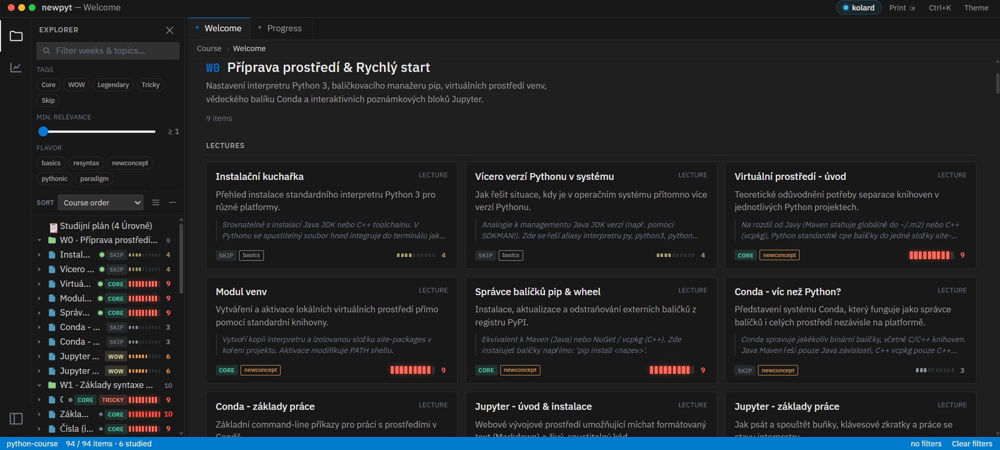
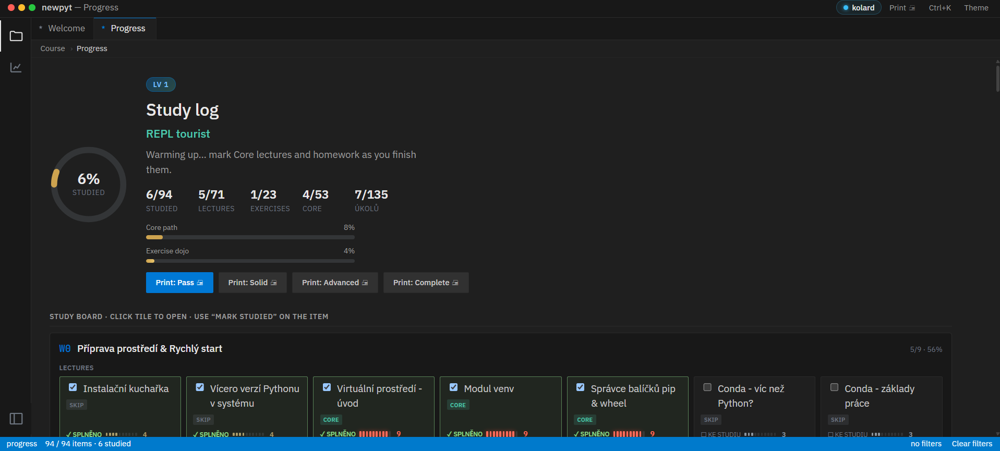
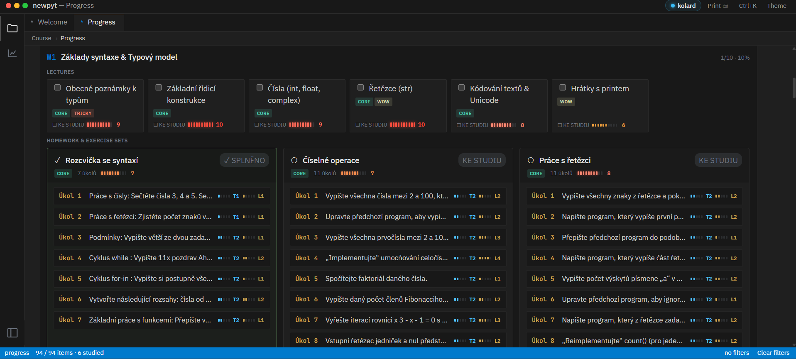
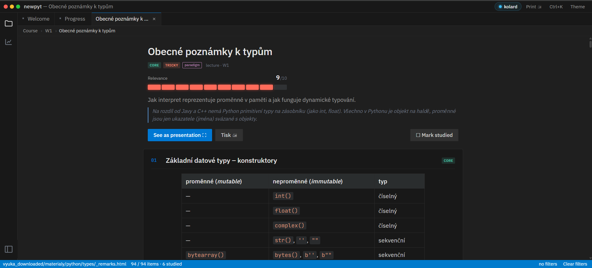
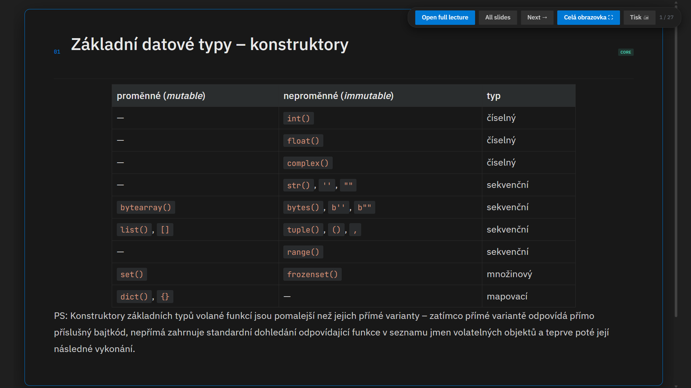
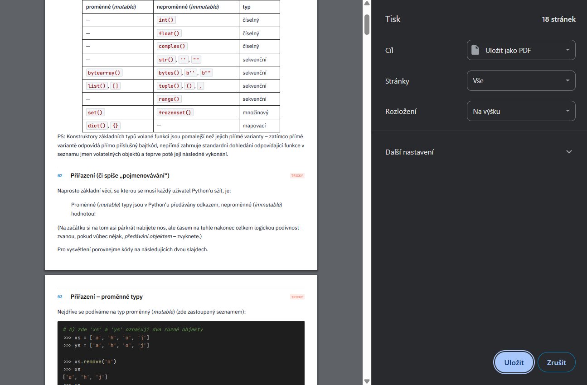
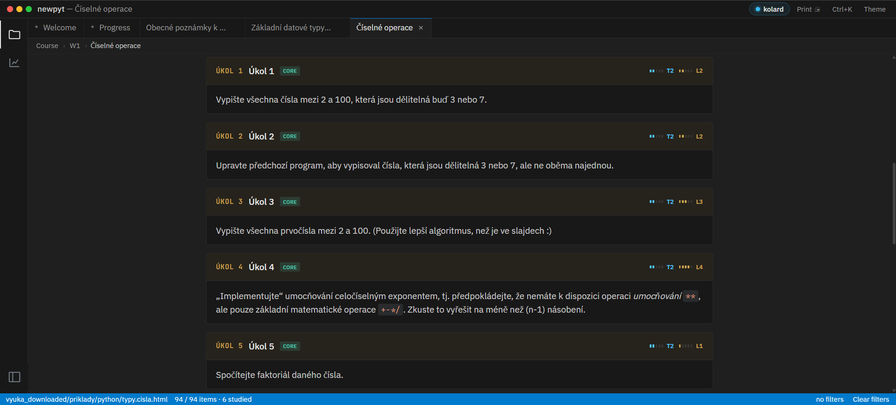

# 🐍 Python Hub — C / C++ / Java → Python Transition Dashboard

> **High-density, web-based learning environment & study dashboard tailored for developers transitioning from C/C++ and Java to Python.**
> 
> **Production Deployment**: [https://newpyt.vercel.app](https://newpyt.vercel.app)  
> **GitHub Repository**: [https://github.com/kolardavidcz/new_pyt](https://github.com/kolardavidcz/new_pyt)

---

## 📸 Interface Showcase & Screenshots

### 1. Main Dashboard & Course Explorer

*VS Code Dark Modern dashboard workspace featuring the Explorer sidebar with multi-dimensional filters (tag chips, relevance heat slider, difficulty flavors), course tree navigation, and week catalog grids.*

### 2. Progress & Study Tracking

#### 2.1 Study Log & Level Progress Tracking

*Study dashboard featuring the 4-level progress ring (`REPL tourist` to `Complete`), Core vs Dojo cumulative progress bars, 4-tier PDF print buttons (`Print: Pass`, `Print: Solid`, `Print: Advanced`, `Print: Complete`), and interactive study board tiles.*

#### 2.2 Exercise Dojo & Homework Progress Matrix

*Detailed exercise tracking matrix breaking down weekly homework sets ("Rozcvička se syntaxí", "Číselné operace", "Práce s řetězci") with individual Úkol task lists and T/L difficulty scores.*

### 3. Lecture & Presentation Views

#### 3.1 Lecture Reader & Data Types Comparison

*Lecture view featuring C++/Java comparison callouts, 10-segment relevance heat meter (`9/10`), slide headers with educational tag badges (`CORE`, `TRICKY`), and side-by-side data type comparison tables (`mutable` vs `immutable`).*

#### 3.2 Presentation Mode & Fullscreen Slide View

*Presentation slide view with top navigation toolbar ("Open full lecture", "All slides", "Next →", "Celá obrazovka ⛶", "Tisk 🖨", slide position counter `1 / 27`), and focused slide section content.*

#### 3.3 Print Engine & PDF Export (`@media print`)

*Browser print preview engine (`window.print()` / `Ctrl+P`) rendering white paper backgrounds (`#ffffff`), high-contrast dark text (`#111827`), tag badges, and VS Code code blocks compliant with WCAG 2.1 AAA standards.*

### 4. Structured Exercise Cards & Difficulty Scoring

*Structured exercise view ("Číselné operace") featuring Úkol problem cards (`Úkol 1` to `Úkol 5`) with tag badges (`CORE`) and visual 5-segment rating bars for **T** (Technical score) and **L** (Logical score) difficulty axes.*

---

## ⚡ Quick Start & Local Execution

### 1. Local Development Server
```bash
# Serve application locally (Default port 8765)
python serve.py 8765
# → Open http://127.0.0.1:8765/app/index.html
```
*The local development server sends `Cache-Control: no-store` headers so UI and stylesheet updates reflect instantly.*

### 2. Data Pipelines & Metadata Transformation
```bash
# Refresh manifest and course structure from archives
python tools/import_course_data.py

# Apply Phase 2 tags & relevance ratings
python tools/apply_phase2_labels.py

# Transform exercises into úkol cards with T/L scores
python tools/transform_exercises.py

# Run WCAG 2.1 Color Contrast Audit Suite
node tools/check_contrast.mjs
```

---

## 🐧 WSL2-First Development Workflow (`/wsl-first`)

This project strictly enforces a **WSL2 (Ubuntu)** execution environment for all command-line operations, package management, and dev server execution.

### Environment & Path Mapping
| Environment / Action | Path Standard | Example Path |
| :--- | :--- | :--- |
| **Windows Explorer Drive B:** | `B:\` | `B:\_solved\python_overview` |
| **WSL Linux Ext4 Mount** | Linux Path | `/mnt/b/_solved/python_overview` or `~/build_projects/...` |
| **File Creation / Editing** | Windows UNC Path | `\\wsl.localhost\Ubuntu\home\kolar\...` |
| **Terminal Commands** | WSL Command | `wsl bash -c "python serve.py 8765"` |

### Toolchain Mandates
- **Package Manager**: `pnpm` for Node.js scripts (`pnpm install`, `pnpm test`).
- **Python Virtualenv**: `uv` (`uv venv`, `uv run <script>.py`).
- **Line Endings**: STRICTLY Linux `LF` (`\n`) across all source code and JSON data stores to prevent git diff noise.

---

## 🏗️ Architecture & Technical Features

```
┌─────────────┬──────────────────┬────────────────────────────────────────────────────────┐
│ Activity    │ Sidebar          │ Editor Group / Workspace                               │
│ Bar         │ EXPLORER Tree    │ Tabs + Breadcrumbs + Lecture / Exercise Slide          │
│ • Explorer  │ • Filters:       │ • Course Lectures, Úkol Cards & PDF Reports           │
│ • Progress  │   - Tag Chips    │ • VS Code Dark+ Code Syntax Highlighting               │
│ • Search    │   - Relevance    │ • Instant Study Progress Buttons                      │
│             │   - Flavors      │ • Bottom Nav: ← Prev | Mark Studied | Next →          │
├─────────────┴──────────────────┴────────────────────────────────────────────────────────┤
│ Status Bar — Active path · Study counts · Filter summary · Cloud Sync Status            │
└─────────────────────────────────────────────────────────────────────────────────────────┘
```

### 1. Single Page Application (SPA) & Dual Persistence
- **Modular ES JS Architecture**: `app/js/` (`app.js`, `state.js`, `router.js`, `content.js`, `tree.js`, `highlight.js`, `ui.js`, `sync.js`).
- **Dual Persistence Engine**:
  - **Local**: `localStorage` (`pcs-seen-v1`, `pcs-studied-v1`, `pcs-sidebar-w`, `pcs-code-block-color`).
  - **Cloud**: Asynchronous, non-blocking background sync with Upstash Redis KV database (`kvGet`, `kvSet`).
- **0ms Feedback Latency**: CSS `transition: none !important;` on study buttons guarantees instant DOM updates without triggering full page re-renders.

### 2. Multi-Dimensional Filters & Navigation
- **Tag Badges**: `[Core]`, `[WOW]`, `[Legendary]`, `[Tricky]`, `[Skip]`.
- **10-Segment Heat Relevance Meter**: Visual score scale (Slate Grey → Amber → Orange → Crimson Red).
- **Flavors**: `basics`, `resyntax`, `newconcept`, `pythonic`, `paradigm`.
- **Dojo Dual Difficulty Bars**: 5-segment rating bars for **T** (Technical score, `#4fc1ff`) and **L** (Logical score, `#cda34f`) difficulty axes across 135 exercises.

### 3. Dual Theme & Code Block Configuration
- **Page UI Theme**: Toggleable Light / Dark mode shell.
- **Code Block Theme (`codeblock_settings`)**:
  - `Dark`: `#1e1e1e` dark background with crisp `#d4d4d4` text and vibrant VS Code Dark+ syntax highlighting (`#569cd6` keywords, `#ce9178` strings, `#6a9955` comments, `#b5cea8` numbers).
  - `Light`: `#f8f9fa` background with `#1f2937` dark code text and light syntax colors.

### 4. Smart Code Formatting (`dedentCode` & Unicode Support)
- **Automatic Dedenting (`dedentCode`)**: Scans code blocks to strip useless outer indentation while preserving 100% of internal relative indentation hierarchy (4-space tabs).
- **Full Czech Unicode Tokenization**: Identifier tokenizers support Czech accented letters (`Á, É, Í, Ó, Ú, Ů, Ý, Ž, Š, Č, Ř, Ď, Ť, Ň`) and hyphens in pseudo-constants (`ZÁCHYTNÝ-BLOK`).
- **Cross-Platform Monospace Font**: Preloaded `JetBrains Mono` WOFF2 fonts for identical, crisp code rendering on PC, Mac, tablets, and mobile devices.

### 5. Printable PDF Layout & WCAG 2.1 AAA Compliance
- **A4 2-Column PDF Print Layout**: `@media print` generates clean, high-contrast 2-column study reports with side-by-side lectures vs exercises.
- **Full WCAG 2.1 Contrast Suite**: `tools/check_contrast.mjs` verifies 40 color pairs across Dark UI Screen, Light UI Screen, and Print Mode (all 40 test cases pass with contrast ratios up to 21.00:1).

---

## 🚢 Deploying to Vercel

The application is deployed as a static export. The preparation script packages the app shell, manifest data, and course resources into `public/`:

```bash
# Assemble static export directory (1,600+ files)
node tools/prepare_vercel.mjs

# Deploy static bundle to production
npx vercel --prod
```

| Deployment Artifact | Role |
| :--- | :--- |
| `vercel.json` | Output directory set to `public/` with cache control and routing rewrites |
| `tools/prepare_vercel.mjs` | Assembles `app/`, `data/`, `.old/cjs/`, and `.old/vyuka_downloaded/` into `public/` |
| `.vercelignore` | Excludes temporary scratch scripts and build artifacts |

---

## 🎹 Keyboard Shortcuts

| Key Combination | Action |
| :--- | :--- |
| `Ctrl+P` | Open Print Mode (Generates 2-Column Study Plan PDF or prints current lecture) |
| `Ctrl+K` | Open Command Palette / Search |
| `Ctrl+B` | Toggle Sidebar (collapse / expand left panel) |
| `Ctrl+Shift+E` | Switch to Explorer View |
| `Ctrl+Shift+F` | Focus Filter Search Input |
| `Ctrl+W` | Close Active Editor Tab |
| `← / → / Space` | Navigate Previous / Next Slide (Presentation mode) |
| `F` | Toggle Presentation Fullscreen Mode |

---

## 📄 License & Credits

Created by **Jiří Znamenáček** & modified for VSČHT Praha Python Course. Single-page application shell, data manifests, and study tracking engine developed for **Python Hub**.
